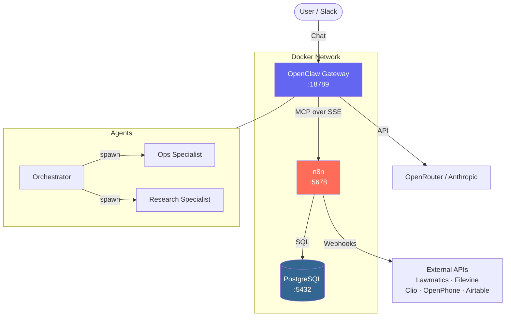

# openclaw-n8n-stack

[](LICENSE)
[](docker-compose.yml)

> Production-ready Docker stack pairing OpenClaw (AI agent gateway) with n8n (workflow automation). One command to deploy, pre-wired MCP, pre-configured multi-agent.

---

## Architecture



**How it works:**
- **OpenClaw** receives user messages, routes them through a multi-agent system
- **n8n** handles deterministic tasks (API calls, data writes, lookups) via MCP -- zero tokens spent
- **PostgreSQL** persists n8n workflows, credentials, and execution history
- AI handles reasoning; n8n handles everything else

---

## Quick Start

```bash
# 1. Clone
git clone https://github.com/lorenzejay/openclaw-n8n-stack.git
cd openclaw-n8n-stack

# 2. Configure
cp .env.example .env
# Edit .env — set POSTGRES_PASSWORD, N8N_ENCRYPTION_KEY,
# OPENCLAW_GATEWAY_TOKEN, and at least one AI provider key

# 3. Deploy
docker compose up -d

# 4. Verify
docker compose ps          # All 3 services should be "healthy"
curl http://localhost:5678/healthz    # n8n
curl http://localhost:18789/healthz   # OpenClaw
```

**Access points:**
| Service | URL | Purpose |
|---------|-----|---------|
| n8n | http://localhost:5678 | Workflow editor & webhook endpoints |
| OpenClaw | http://localhost:18789 | AI agent gateway & control UI |

---

## Architecture: The Token-Saving Pattern

The core idea: **route deterministic tasks to n8n instead of burning AI tokens.**

```
User: "Look up client John Smith"

WITHOUT n8n:
  User → AI → (AI generates API call code) → (AI parses response) → User
  Cost: ~5,000 tokens ($0.01)

WITH n8n:
  User → AI → (MCP call to n8n) → n8n runs workflow → structured result → User
  Cost: ~500 tokens ($0.001) + n8n execution (free)
```

Every CRM lookup, SMS send, database write, and calendar check goes through n8n -- the AI only handles reasoning, drafting, and decision-making.

---

## Configuration Reference

### Environment Variables (`.env`)

| Variable | Required | Default | Description |
|----------|----------|---------|-------------|
| `POSTGRES_PASSWORD` | Yes | -- | PostgreSQL password |
| `N8N_ENCRYPTION_KEY` | Yes | -- | Encrypts n8n credentials at rest |
| `OPENCLAW_GATEWAY_TOKEN` | Yes | -- | Auth token for OpenClaw API |
| `OPENROUTER_API_KEY` | Yes* | -- | OpenRouter API key for AI models |
| `ANTHROPIC_API_KEY` | No | -- | Direct Anthropic API key (alternative to OpenRouter) |
| `POSTGRES_USER` | No | `n8n` | PostgreSQL username |
| `POSTGRES_DB` | No | `n8n` | PostgreSQL database name |
| `N8N_HOST` | No | `localhost` | n8n hostname |
| `N8N_PORT` | No | `5678` | n8n exposed port |
| `N8N_PROTOCOL` | No | `http` | `http` or `https` |
| `WEBHOOK_URL` | No | `http://localhost:5678/` | n8n webhook base URL |
| `N8N_MCP_SERVER_ENABLED` | No | `true` | Enable n8n MCP server |
| `OPENCLAW_PORT` | No | `18789` | OpenClaw exposed port |
| `SLACK_BOT_TOKEN` | No | -- | Slack bot token (optional) |
| `SLACK_APP_TOKEN` | No | -- | Slack app token for socket mode |
| `TZ` | No | `America/New_York` | Timezone |

*At least one AI provider key is required (OpenRouter or Anthropic).

---

## Identity Stack

The `workspace/` directory contains markdown files that define agent behavior:

| File | Purpose |
|------|---------|
| `SOUL.md` | Core identity, principles, and delegation rules |
| `AGENTS.md` | Agent routing instructions and delegation patterns |
| `USER.md` | User profiles and communication preferences |
| `TOOLS.md` | Available MCP tools, when to use n8n vs AI, cost estimates |

Edit these files to customize agent behavior for your use case.

---

## Agent Configuration

Three agents are pre-configured in `config/openclaw.json`:

### Orchestrator (default)
- **Model:** Claude Sonnet 4
- **Role:** Receives all messages, routes to specialists
- **Tools:** read, write, memory_search, sessions_spawn
- **System prompt:** Loaded from `workspace/SOUL.md`

### Ops Specialist
- **Model:** Claude Sonnet 4
- **Role:** Executes workflows via n8n MCP tools
- **Tools:** read, exec (allowlisted to `curl` only)
- **Use for:** API calls, data writes, webhook triggers

### Research Specialist
- **Model:** Claude 3.5 Haiku (fast, cheap)
- **Role:** Searches files, memory, and web
- **Tools:** read, memory_search, web_search, web_fetch
- **Use for:** Information retrieval, document Q&A

---

## Token Savings

Delegating deterministic tasks to n8n eliminates token waste:

| Task | Without n8n | With n8n | Savings |
|------|------------|----------|---------|
| 100 CRM lookups/day | $30/mo | $0 | $30/mo |
| 50 SMS sends/day | $15/mo | $0 | $15/mo |
| 200 audit logs/day | $12/mo | $0 | $12/mo |
| **Total** | **$115/mo** | **$50/mo** | **$65/mo (57%)** |

The remaining $50/mo covers AI reasoning tasks that genuinely need LLM capabilities.

---

## Security

- **No hardcoded secrets** -- all credentials live in `.env` (git-ignored)
- **Token auth** on the OpenClaw gateway
- **Filesystem sandboxing** -- agents can only access `workspace/`
- **Tool restrictions** -- each agent has explicit allow/deny lists
- **Exec allowlist** -- ops-agent can only run `curl`, nothing else
- **Elevated tools disabled** -- no root/system access
- **Non-root container user** -- OpenClaw runs as UID 1000
- **Read-only config mount** -- `openclaw.json` mounted as `:ro`

---

## Troubleshooting

### Services won't start
```bash
# Check logs
docker compose logs postgres
docker compose logs n8n
docker compose logs openclaw-gateway

# Common fix: ensure .env exists and all required values are set
for var in POSTGRES_PASSWORD N8N_ENCRYPTION_KEY OPENCLAW_GATEWAY_TOKEN OPENROUTER_API_KEY; do
  grep -q "^${var}=.\+" .env 2>/dev/null && echo "SET: $var" || echo "MISSING: $var"
done
```

### n8n health check fails
```bash
# n8n needs PostgreSQL to be healthy first
docker compose logs postgres  # Check for auth errors
docker compose restart n8n
```

### OpenClaw can't reach n8n MCP
```bash
# Verify n8n MCP is enabled
docker compose exec n8n wget -qO- http://localhost:5678/mcp

# Check the Docker network
docker compose exec openclaw-gateway wget -qO- http://n8n:5678/healthz
```

### Permission denied on volumes
```bash
# OpenClaw runs as UID 1000 — ensure workspace is writable
sudo chown -R 1000:1000 workspace/
```

### Reset everything
```bash
docker compose down -v   # Removes containers AND volumes
docker compose up -d     # Fresh start
```

---

## Related Projects

- [OpenClaw](https://github.com/openclaw/openclaw) -- AI agent gateway
- [n8n](https://github.com/n8n-io/n8n) -- Workflow automation
- [n8n MCP Documentation](https://docs.n8n.io/integrations/mcp/) -- MCP server setup

---

## License

[MIT](LICENSE) -- Copyright (c) 2025 Lorenz Espinosa
